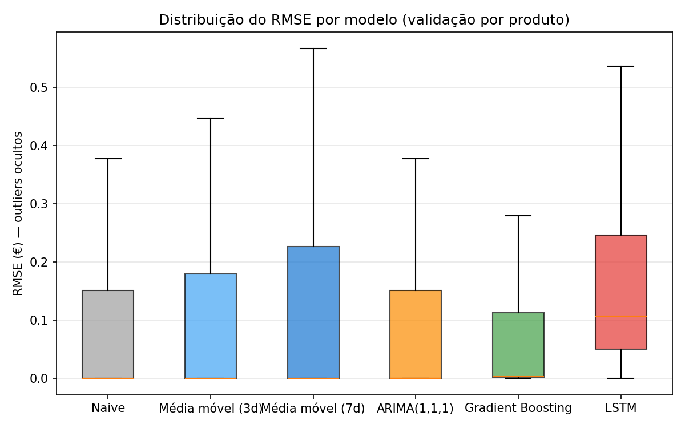
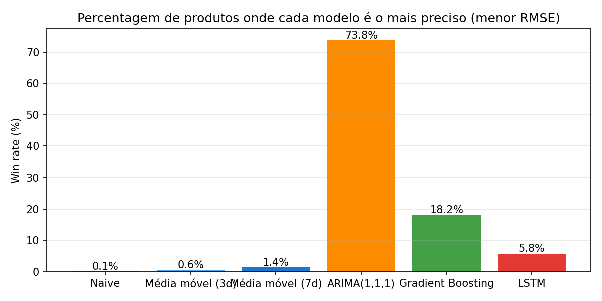

# Comparação de modelos de previsão de preços

Avaliação de baselines (Naive, médias móveis, ARIMA), de um modelo de **gradient boosting** e do **LSTM**, na **mesma janela de validação** (últimos 7 dias por produto) e com as **mesmas métricas** em euros reais (RMSE/MAE/MAPE).

## 1. Resumo global

| Modelo | Produtos | RMSE médio (€) | RMSE std | MAE médio (€) | MAPE médio (%) |
|---|---|---|---|---|---|
| Naive | 2745 | 0.1402 | 0.3336 | 0.0963 | 3.52 |
| Média móvel (3d) | 2745 | 0.1472 | 0.3349 | 0.1092 | 4.07 |
| Média móvel (7d) | 2745 | 0.1723 | 0.3539 | 0.1416 | 5.24 |
| ARIMA(1,1,1) | 2745 | 0.1404 | 0.3336 | 0.0967 | 3.53 |
| Gradient Boosting | 2745 | 0.0968 | 0.21 | 0.0423 | 1.75 |
| LSTM | 2745 | 0.2204 | 0.3545 | 0.1987 | 8.14 |

## 2. Win rate — % de produtos onde cada modelo ganha (menor RMSE)

| Modelo | Wins | Win rate (%) |
|---|---|---|
| Naive | 2 | 0.1 |
| Média móvel (3d) | 17 | 0.6 |
| Média móvel (7d) | 39 | 1.4 |
| ARIMA(1,1,1) | 2027 | 73.8 |
| Gradient Boosting | 500 | 18.2 |
| LSTM | 160 | 5.8 |

## 3. Interpretação

- O modelo com **menor RMSE médio** é **Gradient Boosting** (0.0968 €).
- O modelo com **maior win rate** é **ARIMA(1,1,1)** (73.8%).

> **Nota:** o **Gradient Boosting** tem o menor erro *médio*, mas o **ARIMA(1,1,1)** ganha em mais produtos. Isto indica que o Gradient Boosting é muito melhor nos produtos difíceis (promoções, séries voláteis) — onde os outros falham mais — enquanto o ARIMA(1,1,1) ganha por margem pequena nas muitas séries quase constantes. Para a qualidade global, o erro médio (e o seu desvio-padrão) é a métrica mais relevante.

O **gradient boosting** liderar é consistente com a literatura de *forecasting* tabular de curto prazo: com poucas dezenas de dias por produto, um modelo de árvores sobre features (lags, médias móveis, dia-da-semana, cadeia, promoção) generaliza melhor que uma rede recorrente, treina em segundos e não precisa de normalização.
