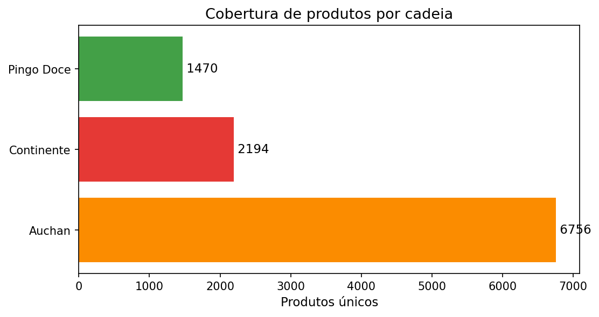
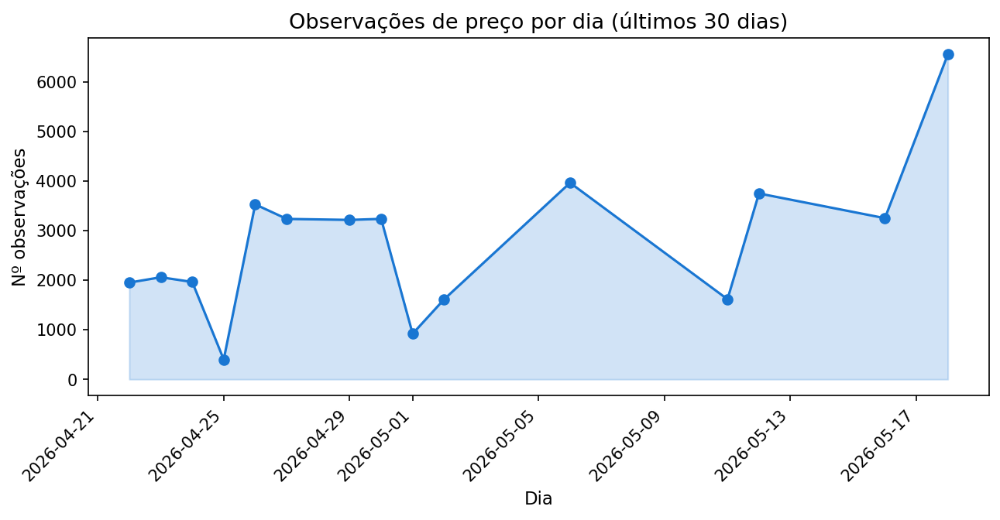
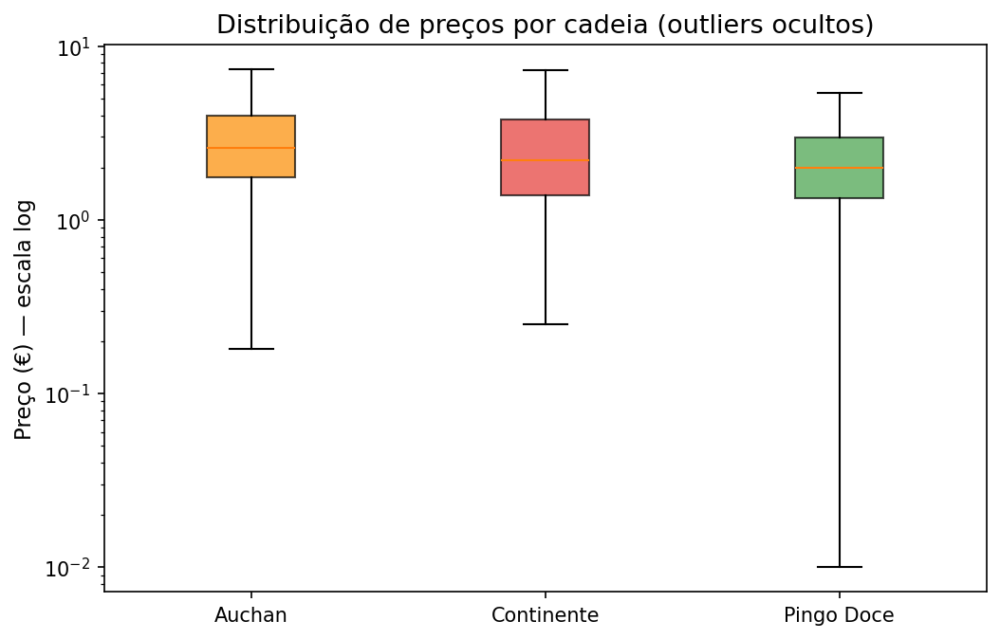
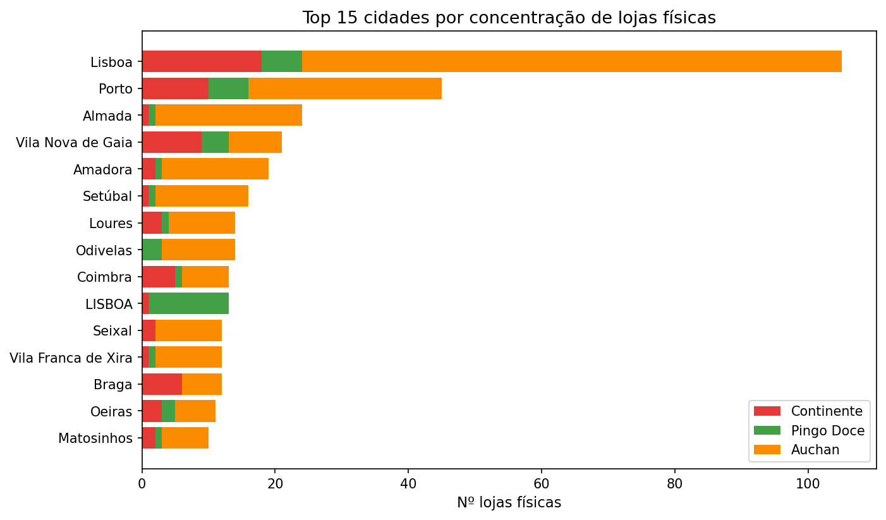
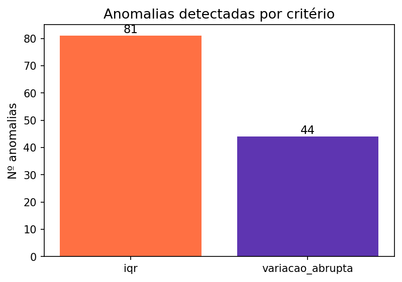

# Relatório de dados — ProjetoSI

_Gerado em 2026-05-19 06:09_

## 1. Contagens globais

| Métrica | Valor |
|---|---|
| Lojas (online) | 3 |
| Lojas físicas | 1061 |
| Produtos mestre | 10589 |
| Produtos × loja | 10420 |
| Preços atuais | 10420 |
| Histórico de preços | 47947 |
| Em promoção (agora) | 1407 |
| Dias distintos no histórico | 21 |
| Primeiro dia observado | 2026-03-10 |
| Último dia observado | 2026-05-18 |

## 2. Cobertura por cadeia

| Cadeia | Produtos únicos | Observações totais | Preço médio (€) | Em promoção |
|---|---|---|---|---|
| Auchan | 6756 | 13579 | 3.28 | 294 |
| Continente | 2194 | 19915 | 3.70 | 8304 |
| Pingo Doce | 1470 | 14453 | 3.57 | 3265 |

## 3. Cobertura por categoria (top 10)

| Categoria | Produtos mestre | Produtos × loja | Preço médio (€) |
|---|---|---|---|
| alimentacao | 6756 | 6756 | 3.40 |
| produtos | 1469 | 1470 | 4.97 |
| mercearia | 1206 | 1218 | 3.66 |
| bebidas-e-garrafeira | 794 | 849 | 4.14 |
| frescos | 95 | 95 | 3.16 |
| laticinios-e-ovos | 29 | 29 | 5.73 |
| marcas | 1 | 1 | 1.29 |
| campanhas | 1 | 1 | 1.49 |
| oportunidades | 1 | 1 | 2.59 |

## 4. Qualidade dos dados (% campos preenchidos)

| Cadeia | Total | % com EAN | % com marca | % com quantidade | % com preço unit. |
|---|---|---|---|---|---|
| Auchan | 6756 | 100.0 | 99.6 | 99.7 | 100.0 |
| Continente | 2194 | 0.0 | 100.0 | 99.3 | 99.4 |
| Pingo Doce | 1470 | 0.0 | 100.0 | 98.7 | 98.9 |

## 5. Observações por dia (últimos 30 dias)

| Dia | Observações | Produtos únicos |
|---|---|---|
| 2026-04-22 | 1950 | 975 |
| 2026-04-23 | 2058 | 687 |
| 2026-04-24 | 1963 | 726 |
| 2026-04-25 | 400 | 400 |
| 2026-04-26 | 3527 | 2630 |
| 2026-04-27 | 3234 | 2359 |
| 2026-04-29 | 3214 | 2431 |
| 2026-04-30 | 3235 | 2364 |
| 2026-05-01 | 919 | 919 |
| 2026-05-02 | 1613 | 1613 |
| 2026-05-06 | 3962 | 2469 |
| 2026-05-11 | 1615 | 1615 |
| 2026-05-12 | 3747 | 2616 |
| 2026-05-16 | 3249 | 2503 |
| 2026-05-18 | 6552 | 3764 |

### Distribuição de preços por cadeia

## 6. Cobertura geográfica (top 20 cidades)

| Cidade | Total lojas | Continente | Pingo Doce | Auchan |
|---|---|---|---|---|
| Lisboa | 105 | 18 | 6 | 81 |
| Porto | 45 | 10 | 6 | 29 |
| Almada | 24 | 1 | 1 | 22 |
| Vila Nova de Gaia | 21 | 9 | 4 | 8 |
| Amadora | 19 | 2 | 1 | 16 |
| Setúbal | 16 | 1 | 1 | 14 |
| Loures | 14 | 3 | 1 | 10 |
| Odivelas | 14 | 0 | 3 | 11 |
| Coimbra | 13 | 5 | 1 | 7 |
| LISBOA | 13 | 1 | 12 | 0 |
| Seixal | 12 | 2 | 0 | 10 |
| Vila Franca de Xira | 12 | 1 | 1 | 10 |
| Braga | 12 | 6 | 0 | 6 |
| Oeiras | 11 | 3 | 2 | 6 |
| Matosinhos | 10 | 2 | 1 | 7 |
| Torres Vedras | 9 | 2 | 0 | 7 |
| Viseu | 9 | 0 | 1 | 8 |
| Maia | 9 | 3 | 0 | 6 |
| Cascais | 8 | 0 | 1 | 7 |
| Moita | 8 | 2 | 1 | 5 |

## 7. Anomalias detectadas

**Resumo por critério:**

| Critério | Contagem |
|---|---|
| iqr | 81 |
| variacao_abrupta | 44 |

**Top 10 anomalias mais antigas:**

| Produto | Cadeia | Preço (€) | Dia | Critério |
|---|---|---|---|---|
| Massa Esparguete Nº5 Barilla 500g | Continente | 1.99 | 2026-05-12 00:00:00 | variacao_abrupta |
| Bolachas Marinheiras Com Chia Cem Porcento 200g | Continente | 2.89 | 2026-04-08 00:00:00 | iqr |
| Bolachas Marinheiras Com Chia Cem Porcento 200g | Continente | 2.89 | 2026-04-16 00:00:00 | iqr |
| Bolachas Marinheiras Com Chia Cem Porcento 200g | Continente | 2.89 | 2026-04-16 00:00:00 | iqr |
| Bolachas Marinheiras Com Chia Cem Porcento 200g | Continente | 2.89 | 2026-04-18 00:00:00 | iqr |
| Bolachas Marinheiras Com Chia Cem Porcento 200g | Continente | 2.89 | 2026-04-18 00:00:00 | iqr |
| Bolachas Marinheiras Com Chia Cem Porcento 200g | Continente | 2.89 | 2026-04-18 00:00:00 | iqr |
| Bolachas Marinheiras Com Chia Cem Porcento 200g | Continente | 2.89 | 2026-04-18 00:00:00 | iqr |
| Bolo Planetus Manhãzitos 300g | Continente | 4.39 | 2026-04-08 00:00:00 | iqr |
| Bolo Planetus Manhãzitos 300g | Continente | 4.39 | 2026-05-06 00:00:00 | iqr |

## 8. Comparação LSTM vs. modelos baseline

Avaliação na mesma janela de validação (últimos 7 dias por produto), com mesmas métricas em euros reais (RMSE/MAE/MAPE). Comparação apples-to-apples entre o LSTM e 4 baselines clássicos.

### 8.1 Resumo global (médias por modelo)

| Modelo | Produtos | RMSE médio (€) | RMSE std | MAE médio (€) | MAPE médio (%) |
|---|---|---|---|---|---|
| Naive | 1949 | 0.1607 | 0.3582 | 0.1379 | 5.54 |
| Média móvel (3d) | 1949 | 0.1704 | 0.365 | 0.1489 | 5.9 |
| Média móvel (7d) | 1949 | 0.1775 | 0.3588 | 0.1607 | 6.32 |
| ARIMA(1,1,1) | 1949 | 0.161 | 0.3581 | 0.1382 | 5.55 |
| LSTM | 1949 | 0.2005 | 0.3295 | 0.1803 | 7.56 |

### 8.2 Win rate (% de produtos onde cada modelo é o mais preciso)

| Modelo | Wins | Win rate (%) |
|---|---|---|
| Naive | 1 | 0.1 |
| Média móvel (3d) | 10 | 0.5 |
| Média móvel (7d) | 77 | 4.0 |
| ARIMA(1,1,1) | 1499 | 76.9 |
| LSTM | 362 | 18.6 |

### 8.3 Interpretação
- O modelo com **menor RMSE médio** é **Naive**.
- O modelo com **maior win rate** (mais produtos vencidos) é **ARIMA(1,1,1)**.

Notas: o **LSTM tem o menor desvio-padrão** do RMSE, ou seja, é o **mais consistente** entre produtos — mesmo quando perde em média. Os baselines simples (Naive, ARIMA(1,1,1)) tendem a vencer em **séries curtas** com pouca variação dia-a-dia (típico de preços de supermercado). Espera-se que o LSTM melhore à medida que se acumulem mais dias de scraping e padrões sazonais semanais (promoções) fiquem detectáveis.

_CSVs detalhados por produto:_
- `models/saved_models/avaliacao_val.csv` (LSTM)
- `models/saved_models/avaliacao_baseline.csv` (Naive)
- Comparação completa em `data/relatorio/comparacao_modelos.md` (corre `python scripts/comparar_modelos.py` para regenerar)
